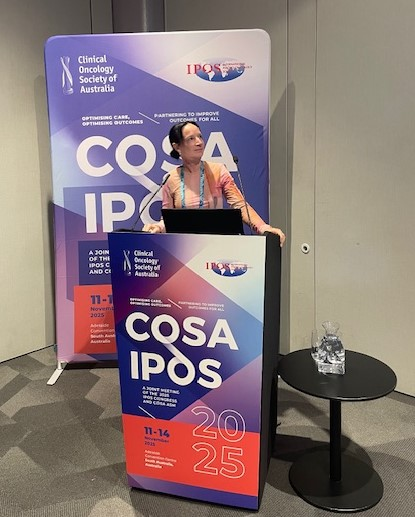

## News and updates

Recruitment for the SWEET study is now closed.
Thanks to the amazing response we've successfully reached over our recruitment target.

The Study is now in the follow-up stage, to find out more [<b>click here to read our latest newsletter.</b>](../../assets/study_documents/SWEET_ParticipantNewsletter_v1.0_28Nov25_Vol1.pdf)

## Recent presentations

Dr Lucy McGeagh with the SWEET poster at The UK Interdisciplinary Breast Cancer Symposium in January 2026.

Dr Jo Brett presenting at International Psycho-Oncology Society Annual World Congress in November 2025.

Lesley Turner presenting at the MASCC 2024 Annual Meeting in June.

The SWEET team have presented at the following recent conferences. 
In September we will be presenting at the RCN International Nursing Research Conference in Glasgow.

